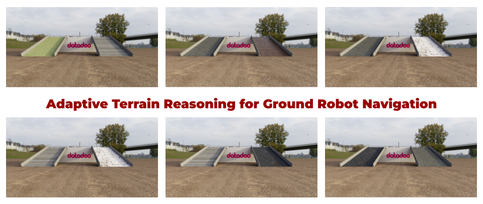
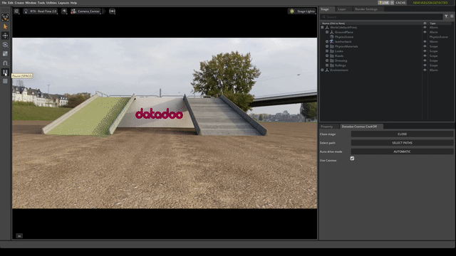
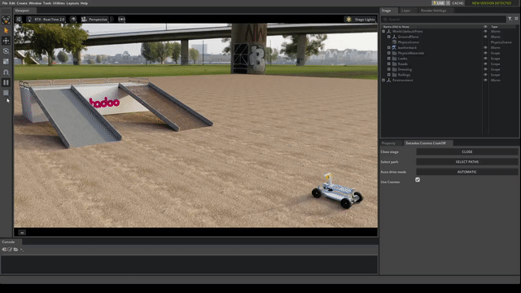
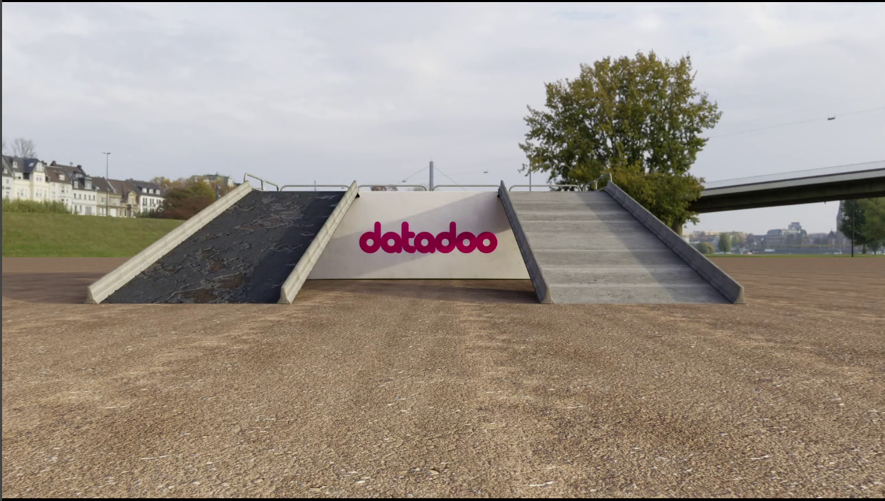

# Adaptive Terrain Reasoning for Ground Robot Navigation

 

> *An intuitive and generalizable approach to terrain-aware navigation under variable grip and surface conditions*

Adaptive Terrain Reasoning for Ground Robot Navigation is a physical AI robotics solution built on top of NVIDIA Cosmos Reason 2 to help a wheeled ground robot choose the safest and most effective path under changing terrain conditions.

This repository contains two main contributions:


1. A **custom two-call inference API** built on top of the official `nvidia-cosmos/cosmos-reason2` repository for terrain reasoning and structured path selection
2. An **Isaac Sim extension** that uses the API output to drive a wheeled robot through the selected path in simulation

The goal is to demonstrate a more intuitive, explainable, and generalizable terrain-aware control workflow than rigid rule-based navigation.


---

## Project overview

In the reference scenario, a wheeled robot must reach the top of a platform by selecting one of two possible ramps. At the beginning of the route, an onboard camera image is captured and sent to the reasoning API. The API compares both candidate paths, returns a structured decision, and the Isaac Sim extension uses that decision to command the robot along the chosen route.

This project uses **Cosmos Reason 2** because the task is not only about visual recognition. The terrain can vary in grip, roughness, bumpiness, and traversal difficulty. The model must reason about terrain in terms of how it may affect robot motion, controllability, and path success.

 

Rather than using a rigid set of hardcoded rules, the system uses natural language reasoning reasoning as an abstraction layer between perception and control. 

This makes the decision process:

* more interpretable
* easier to inspect
* easier to generalize
* easier to integrate into embodied simulation workflows


---

## Repository structure

```bash
.
├── scripts/
│   └── image_api_server_2call.py
├── prompts/
│   └── image_traversability.yaml
├── extension/
│   └── datadoo.cosmos_cookoff/
│       ├── config/
│       ├── data/
│       ├── datadoo/cosmos_cookoff/
│       ├── docs/
│       ├── .gitignore
│       ├── README.md
│       └── premake5.lua
├── docs/
│   ├── attachments/
│   └── project_description.md/
└── README.md
```

### Included in this repository

This project is based on the official Cosmos Reason 2 repository and serving workflow. We started from a clone of the upstream repo and added our custom task-specific components inside the existing project structure.

Our additions are mainly:

* `scripts/image_api_server_2call.py`
A custom Flask app that wraps a two-call Cosmos Reason 2 reasoning pipeline and exposes an HTTP endpoint
* `prompts/image_traversability.yaml` 
A custom prompt for comparative terrain reasoning between two candidate paths
* `extension/datadoo.cosmos_cookoff/`
An Isaac Sim extension and simulation assets for embodied testing and demonstration


---

## Core idea: two-call reasoning pipeline

To preserve reasoning quality while still returning a structured output for downstream control, the API uses a two-call approach.

### First call: reasoned terrain analysis

The first call is intentionally **not constrained by a JSON schema**.

It generates:

* a comparison of both candidate paths
* terrain reasoning for each slope
* `<think>` and `<answer>` content

This step allows the model to reason freely before being forced into a structured format.

### Second call: structured decision-making

The second call extracts the relevant information from the first response and converts it into a schema-constrained JSON output.

This second step produces a deterministic machine-consumable response for downstream robot control.

### Final output

The final API response includes:

* `chosen_path` with the selected route
* `analysis` contains the description of each path and the final decision
* `reasoning` contains the first-call `<think>` and `<answer>` output


---

## Quickstart options

There are two ways to use this project:


1. **Hosted endpoint (recommended)**
Run the Isaac Sim extension directly against our hosted inference endpoint. This is the fastest way to reproduce the embodied demo.
2. **Local deployment**
Serve Cosmos Reason 2 following the official workflow and run the custom `image_api_server_2call.py` wrapper locally.


---

## Hosted endpoint

By default, our Isaac Sim extension connects directly to our hosted inference endpoint, which for the purpose of the contest, we have published at https://nvidiacookoff.datadoo.net/analyze. With this, anybody trying this code, can query the endpoint for the duration of this contest and maximum until the week of the 30 of March. Like this we allow users to reproduce the embodied demo without serving Cosmos Reason 2 or the two-call API locally.

This is the recommended path for users who want to quickly test the full workflow end-to-end. You can just follow the instructions in the *Installing the Isaac Sim extension* section.

If you want to inspect or reproduce the full deployment stack, the repository also includes the task-specific prompt and the custom two-call API wrapper used in our implementation.


---

## Local deployment

### 1. Clone the repository

```bash
git clone https://github.com/datadoo/cosmos-cookoff.git
```

### 2. Follow the official Cosmos Reason 2 setup

This repository is based on the official `nvidia-cosmos/cosmos-reason2` setup. You can use either:

* a local environment
* or the official Docker-based workflow

If you want to use Docker, build the image from the repository root:

```bash
image_tag=$(docker build -f Dockerfile --build-arg=CUDA_VERSION=12.8.1 -q .)
```

Then run it:

```bash
docker run -it --gpus all --ipc=host --rm \
  -p 8000:8000 \
  -p 5000:5000 \
  -v .:/workspace \
  -v /workspace/.venv \
  -v /workspace/examples/cosmos_rl/.venv \
  -v /root/.cache:/root/.cache \
  -e HF_TOKEN="$HF_TOKEN" \
  $image_tag
```

If you prefer a local install, follow the upstream Cosmos Reason 2 installation instructions.

### 3. Start the Cosmos Reason 2 online server

Start the model server in one terminal:

```bash
vllm serve nvidia/Cosmos-Reason2-2B --port 8000 --host 0.0.0.0
```

Wait until the server prints:

```bash
Application startup complete.
```

### 4. Start the custom 2-call API

In a second terminal, run the script with the Flask wrapper (if needed, install flask `uv pip install flask>=3.0.0`):

```bash
python scripts/image_api_server_2call.py
```

This service exposes the task-specific endpoint that:


1. sends the first reasoning request
2. extracts the relevant terrain analysis
3. sends the second schema-constrained request
4. returns the final structured decision

From your local machine:

```bash
curl -X POST http://server:5000/analyze -F "image=@picture.jpg"
```


---

## Isaac Sim integration

IsaacSim 6.0.0-dev were used for this extension.

The extension:

* captures the robot's onboard camera image
* sends the image to the custom API
* reads the `chosen_path` field from the structured response
* commands the robot to follow the selected route

The default stage contains:

* the wheeled robot at the start position
* two candidate ramps
* custom menu:
  * load / close stage
  * select path randomly
  * automatic / manual driving mode
  * enable / disable the use of cosmos
  * if use cosmos is disabled → select manually path (left, right)


---

## Installing the Isaac Sim extension

The extension is stored inside:

```bash
extension/datadoo.cosmos_cookoff/
```

- Clone this project in your environment `<env_path>/<repository_path>`
```
git clone https://github.com/datadoo/cosmos_cookoff.git
```
- Add `<env_path>/<repository_path>/extension` to IsaacSim extensions

### Option A:


1. Open the .kit file you use for your development: `<isaacsim_path>/apps/isaacsim.exp.full.kit`
2. Add the following lines:

   
   1. Under `[dependencies]`:

   ```
   [dependencies]
   "datadoo.cosmos_cookoff" = {}
   ```

   
   1. After `[settings]` block:

   ```
   app.exts.devFolders.'++' = [ 
   <extensions_path>,
   ]
   ```

### Option B - Isaac Sim UI:


1. Open Isaac Sim
2. Copy under the default extensions path the content of `<repository_path>/extension`
2. Go to **Window > Extensions**
3. Open the extension settings
4. Search for the extension under the **Third Party** tab.
5. Enable it


---

## Running the embodied demo

If not using our Hosted endpoint, otherwise go to step 3:


1. Start the official Cosmos Reason 2 serving workflow
2. Start `scripts/image_api_server_2call.py`
3. Open Isaac Sim
4. Add and enable the extension
5. Load the demo scene
6. Configure the menu control options
7. Trigger the decision pipeline
8. Observe:
   * the robot initial position (POV `Camera_Center`)
   * in a new console:
     * the returned reasoning
     * the structured decision
     * the selected path
   * the robot traversal result

 


---

## Evaluation

The simulation environment is not only a visualization tool but also an evaluation framework.

The terrain properties of both ramps can be randomized, including the physical conditions that determine whether the robot can successfully climb them or not. This enables repeatable testing under changing grip and traversal conditions.

 


---

## Example API behavior

Given an onboard image showing two slopes, mapped as:

left slope → chosen_path: 0

right slope → chosen_path: 1


 

The API returns a structured response such as:

```bash
{
  "chosen_path": 1,
  "analysis": {
    "left_path": {
      "confidence": 0.3,
      "grip": "low",
      "surface": "rough, uneven with cracks and debris"
    },
    "right_path": {
      "confidence": 0.7,
      "grip": "high",
      "surface": "smooth, even concrete"
    },
    "reason": "The right slope's smoother surface offers superior traction and stability, making it the preferable choice for the RC car's movement."
  },
  "reasoning": "<think>
Okay, let's break this down. The RC car is positioned equidistant from both left and right slopes, so I need to analyze each slope's terrain to determine which is more drivable.

Starting with the left slope: it has a rough, uneven surface with visible cracks and debris. The texture looks jagged, which might reduce traction. Cracks could cause instability, especially when accelerating or turning. Debris might also get lodged in the tires, leading to unpredictable movement. The slope's angle isn't specified, but the unevenness suggests it's not smooth, making it harder to maintain speed and control.

Now the right slope: it's smoother with a clean, even surface. The concrete looks uniform, which should provide better traction. No visible cracks or debris, so the tires can glide more easily. The slope's angle isn't shown, but the evenness implies it's suitable for consistent movement. Stability is likely better here compared to the left slope.

Considering drivability, the right slope's smoothness and lack of obstacles make it preferable. The left slope's roughness and debris would hinder performance, risking slippage or getting stuck. Even though both slopes have similar inclines, the right's surface quality outweighs the left's challenges.
</think>
<answer>
The right slope is more drivable due to its smoother, even concrete surface with no visible cracks or debris, providing better traction and stability for the RC car. In contrast, the left slope's rough, uneven texture with cracks and debris would hinder consistent movement and increase the risk of instability or getting stuck.
</answer>"
}
```

Note that the only required field would be `chosen_path`; the rest of the fields `analysis` and `reasoning` are for demonstration purposes only and for debugging the physical reasoning of the model.


---

## Future work

Possible next steps include:

* multi-step re-planning during traversal
* support for more than two candidate paths
* richer temporal terrain understanding from image sequences


---

## Acknowledgments

This project builds on the official NVIDIA Cosmos Reason 2 repository and its serving workflow, and uses NVIDIA Isaac Sim for embodied simulation and evaluation.